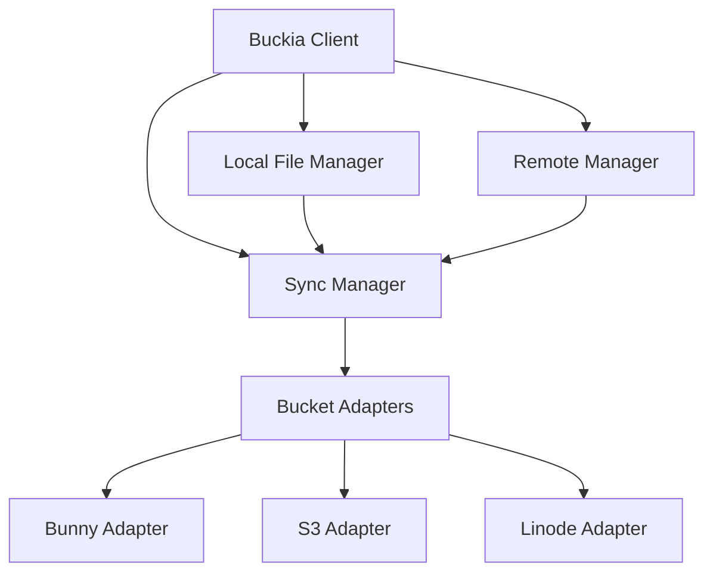

# Buckia Architecture

## System Overview

Buckia follows a pluggable architecture with three core components:



## Backend-Independent Design

The library uses a plugin-based architecture that allows for easy addition of new storage backends:

1. **Abstract Base Class**: All backend implementations inherit from the `BaseSync` abstract base class, which defines the required interface.
2. **Factory Pattern**: A factory creates the appropriate backend based on the configuration.
3. **Common Interface**: All backends implement the same methods (`upload_file`, `download_file`, etc.) allowing the client to work with any provider.
4. **Configuration Adapters**: Provider-specific settings are normalized to a common format.

This approach allows users to switch providers with minimal code changes and enables cross-platform implementations to share the same architecture.

## Project Structure

```
buckia/
├── __init__.py
├── client.py           # Main client interface
├── config.py           # Configuration handling
├── cli.py              # Command-line interface
└── sync/
    ├── __init__.py
    ├── base.py         # Base synchronization classes
    ├── factory.py      # Backend factory
    ├── bunny.py        # Bunny.net implementation
    ├── s3.py           # S3 implementation
    └── linode.py       # Linode implementation
```

## Sync Process

The sync process follows these steps:

1. **Scan**: Scan local and remote files to build file manifests
2. **Compare**: Compare manifests to identify changes
3. **Apply Cache**: Apply any changes from the cache directory
4. **Plan**: Create a plan for uploads, downloads, and deletions
5. **Execute**: Execute the plan with parallel operations
6. **Verify**: Verify completed transfers

## File Tracking

Files are tracked using:

- File paths (relative to root directory)
- Content checksums (SHA-256 by default)
- Modification timestamps
- File metadata (MIME types, etc.)

## Backend Implementation Status

| Backend | Status | Notes |
|---|---|---|
| Bunny.net | Complete | Supports direct API and bunnycdnpython |
| AWS S3 | Skeleton | Placeholder implementation |
| Linode | Skeleton | Placeholder implementation |
| Backblaze B2 | Planned | — |

## Adding a New Backend

1. Create a new class that inherits from `BaseSync` in `sync/`
2. Implement all required methods from the base class
3. Add the backend to the factory in `sync/factory.py`
4. Add appropriate optional dependencies to `pyproject.toml`

## Cross-Platform Support

Buckia is designed to work across:

- **Operating Systems**: Windows, macOS, Linux
- **Languages**: Python (complete), Swift for iOS/macOS (see [Swift guide](../mobile/swift.md)), Kotlin for Android (planned)
- **Runtime Environments**: Server, CI/CD pipelines, desktop applications
